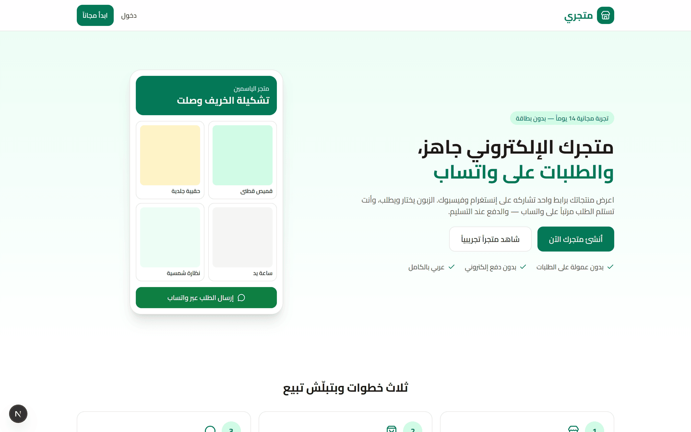
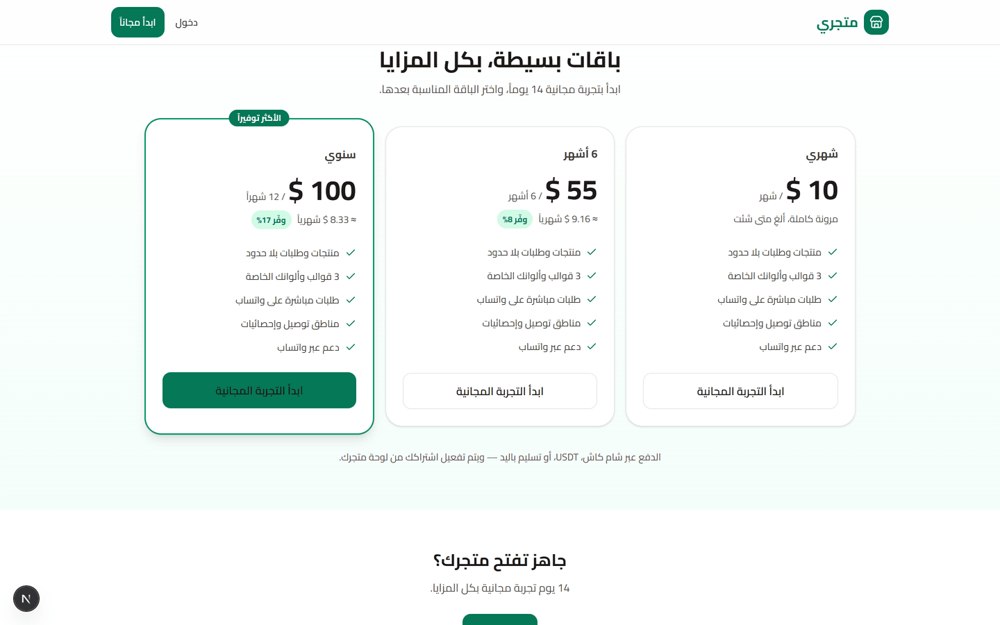
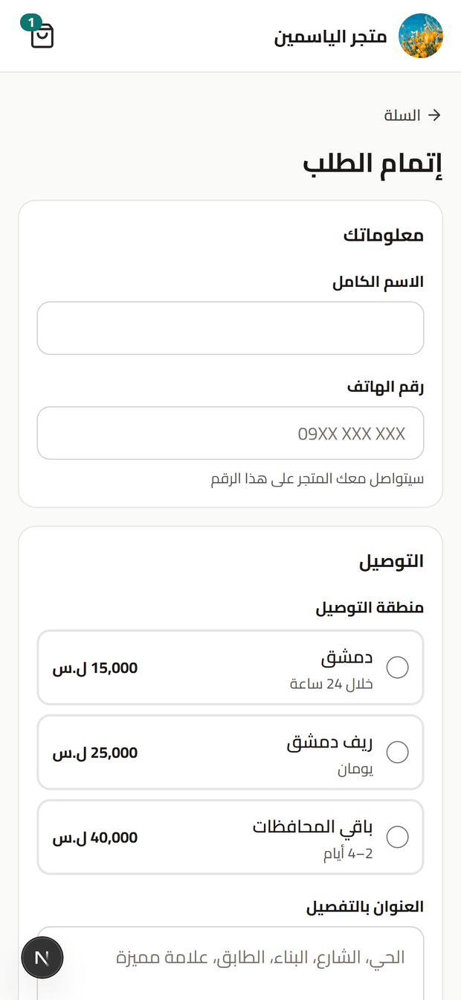
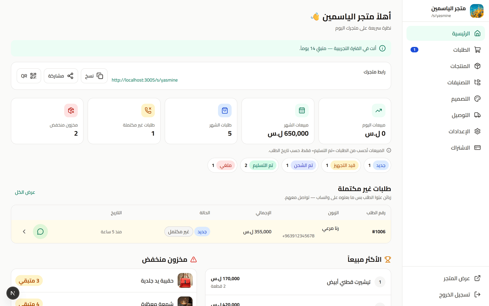
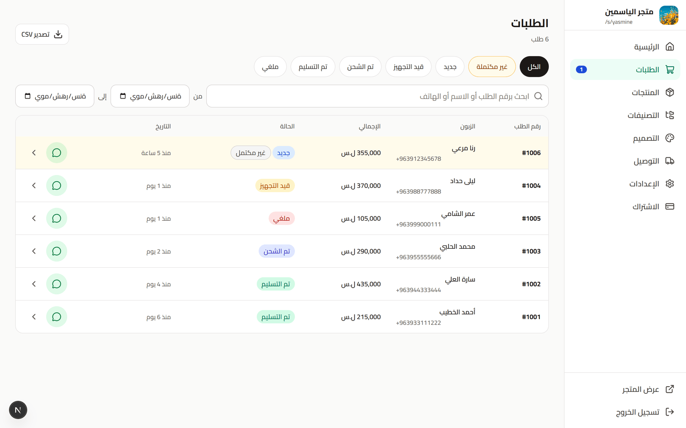
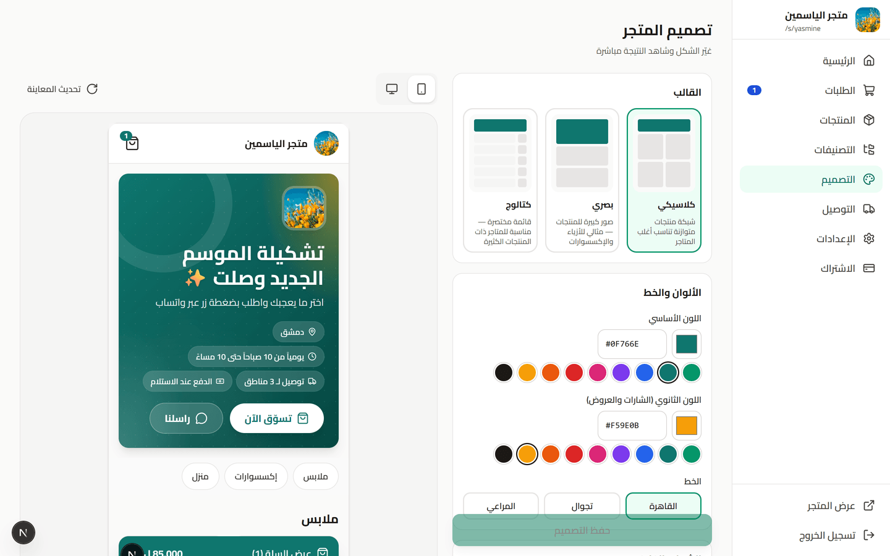
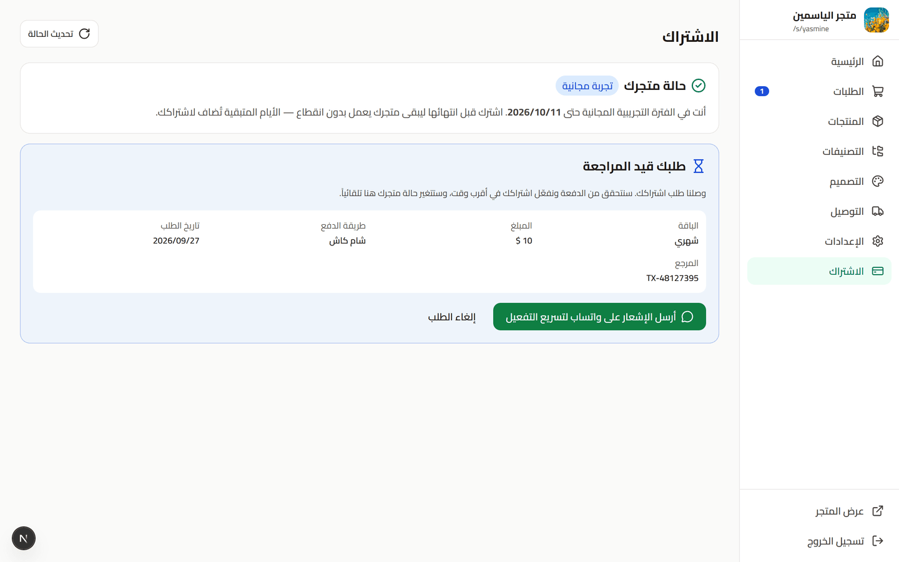
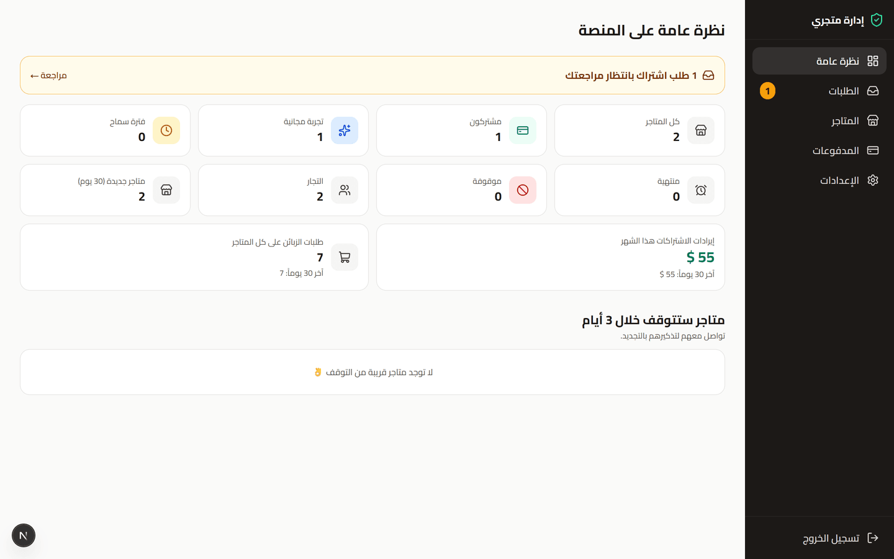
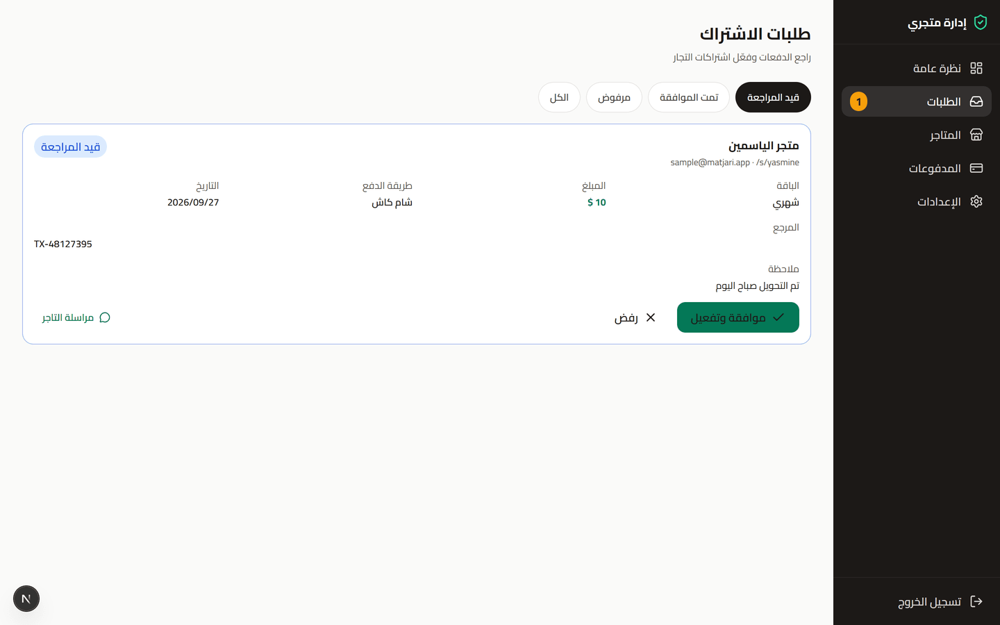

<div align="center">

# Matjari · متجري

**A multi-tenant SaaS that turns a WhatsApp seller into a real online store — in minutes, without writing a line of code.**

Merchants sign up, add products, pick a theme and get a mobile-first storefront at `/s/their-slug`.
Customers browse, fill a cart and tap one button: the order is **saved to the database first**, then WhatsApp opens with a ready-made message carrying the order number.

[](https://github.com/Abdo-Houry/e-commerceSaaS/actions/workflows/ci.yml)
[](LICENSE)


[Live demo](#-live-demo) · [Screenshots](#-screenshots) · [Architecture](#-architecture) · [Engineering highlights](#-engineering-highlights) · [Run locally](#-run-it-locally) · [بالعربية](README.ar.md)

</div>

---

## The problem

Across Syria and the wider MENA region, thousands of small shops sell through Instagram and WhatsApp. Orders arrive as a stream of messages — *"how much?"*, *"is size M available?"*, a voice note with an address — and the seller copies them into a notebook. Nothing is searchable, stock is guesswork, and abandoned conversations are invisible.

Off-the-shelf e-commerce platforms don't fit: they assume online card payments (largely unavailable), charge in foreign currency, and are built left-to-right and English-first.

**Matjari keeps the part that works — the WhatsApp conversation — and fixes everything around it.**

---

## 🌍 Live demo

**https://matjari-3elt.onrender.com**

| Try | Where | Sign in |
|---|---|---|
| **Storefront + WhatsApp checkout** | [/s/demo](https://matjari-3elt.onrender.com/s/demo) | — (best on a phone; the template switcher is live) |
| **Merchant dashboard** | [/login](https://matjari-3elt.onrender.com/login) | `sample@matjari.app` / `sample12345` |
| **Platform admin panel** | [/admin](https://matjari-3elt.onrender.com/admin) | `admin@matjari.app` / `matjari-demo-2026` |

> Hosted on free tiers (Render + Neon): the first request after a quiet period wakes the
> servers and can take up to a minute. Payment details on the subscription page are
> placeholders, and the demo data restores itself on every restart — feel free to break things.

> The demo storefront accepts cart actions but blocks checkout: it exists to show the customer experience, not to send real orders.

---

## ✨ What it does

### For the customer (no account, no app)
- Mobile-first storefront, Arabic and RTL throughout, under `/s/{slug}`.
- Product pages with a swipeable gallery, variants (size / colour), stock awareness and discount badges.
- Cart saved in `localStorage`, delivery-zone fees, minimum-order rules.
- One tap → the order is stored, then WhatsApp opens with a formatted message.

### For the merchant
- 4-step onboarding: store name and slug (live availability check), WhatsApp number, logo and colours, template.
- Products with up to 5 reorderable images, option builder, stock tracking, categories, delivery zones.
- Orders board with filters, a strict status flow, CSV export and **abandoned checkouts** surfaced as «طلبات غير مكتملة».
- Live design editor: colours, fonts, banner and one of three templates, previewed in an iframe as you type.
- Stats: today / month revenue (delivered orders only), top products, low stock.
- Subscription page: pick a plan, pay manually (Sham Cash, USDT, cash), submit the receipt.

### For the platform owner (admin panel)
- Stores by subscription state, revenue, orders, and stores about to expire.
- Subscription requests: review the receipt, approve (activates instantly) or reject with a reason.
- Activate / extend / suspend any store; every activation is recorded as a payment.
- Platform settings: plans and prices, trial and grace days, payment methods, support number.

---

## 📸 Screenshots

| Landing page | Pricing |
|---|---|
|  |  |

| Storefront (mobile) | Product page | Checkout |
|---|---|---|
|  |  |  |

| Merchant dashboard | Orders |
|---|---|
|  |  |

| Live design editor | Subscription |
|---|---|
|  |  |

| Admin overview | Subscription requests |
|---|---|
|  |  |

---

## 🏗 Architecture

```
                         ┌──────────────────────────────┐
  Customer (phone)  ───▶ │  Next.js 16 · App Router     │
  Merchant          ───▶ │  Server Components + ISR     │
  Platform admin    ───▶ │  Tailwind 4 · RTL-first      │
                         └───────────────┬──────────────┘
                                         │ REST (JSON)
                         ┌───────────────▼──────────────┐
                         │  Express 5 · TypeScript      │
                         │  zod validation · JWT auth   │
                         │  per-store scoped repository │
                         └───────────────┬──────────────┘
                                         │ TypeORM (migrations)
                         ┌───────────────▼──────────────┐
                         │  PostgreSQL 18               │
                         └──────────────────────────────┘

  packages/shared → zod schemas + types + money/phone/WhatsApp helpers,
                    imported by BOTH apps so the contract can't drift.
```

| Layer | Choice | Why |
|---|---|---|
| Frontend | Next.js 16 (App Router), React 19 | Storefronts are Server Components with ISR: fast, SEO-ready pages that survive being shared on Instagram |
| Styling | Tailwind CSS 4 | Design tokens in CSS variables; merchant themes applied at runtime without generating classes |
| Backend | Express 5 + TypeScript (CommonJS) | Small, explicit, easy to host anywhere |
| ORM | TypeORM + migrations | `synchronize` is off — a database holding real orders never auto-migrates |
| Validation | zod, shared between apps | One schema validates the browser form and the HTTP body |
| Auth | JWT access (15 min, in memory) + refresh cookie (7 days, httpOnly) | Access tokens never touch `localStorage` |
| Tests | `node:test` + real PostgreSQL | Integration tests exercise money, stock and concurrency against the real database |

Deeper write-up: **[docs/ARCHITECTURE.md](docs/ARCHITECTURE.md)**.

---

## 🔬 Engineering highlights

The parts worth reading the code for.

### 1. The order exists before WhatsApp opens
A message is fire-and-forget; a row is not. The client creates the order, receives its number, *then* opens `wa.me`:

```ts
await placeOrderThenOpenWhatsapp(input, {
  createOrder,                  // POST /api/public/orders  → { id, orderNumber, whatsappUrl }
  onCreated,                    // navigate to the thank-you page
  markWhatsappOpened,           // PATCH .../whatsapp-opened (keepalive)
  openWhatsapp,                 // window.location.href = wa.me/...
});
```

Orders created but never sent stay in the database with `whatsappOpened = false` and are surfaced to the merchant as abandoned checkouts — a feature, not an error state. [`checkout-flow.ts`](packages/shared/src/utils/checkout-flow.ts)

### 2. Order lines are frozen at purchase time
`OrderItem` stores `productName` and `unitPrice`; the delivery zone's name and fee are copied onto the order. Renaming, repricing or deleting a product can never rewrite history or change past revenue — covered by an integration test that edits and deletes products, then re-reads the order and the stats.

### 3. Order numbers are sequential per store, with no gaps
Issued under a row lock in the same transaction that inserts the order:

```ts
await dataSource.transaction(async (m) => {
  const store = await m.findOne(Store, { where: { id }, lock: { mode: 'pessimistic_write' } });
  const orderNumber = store.orderCounter + 1;
  …
});
```

A test fires eight concurrent checkouts and asserts the numbers come out `1001…1008`.

### 4. The server never trusts client prices
`POST /api/public/orders` re-reads every product, recomputes the subtotal, validates options and stock, applies the zone fee and the minimum-order rule, and builds the WhatsApp text itself so the format can't drift. A test posts tampered prices and asserts the stored line price comes from the database.

### 5. Tenant isolation you can't forget
Every merchant query goes through `scopedRepo(Entity, storeId)`, and a record from another store returns **404, not 403** — so the API never reveals that an id exists.

### 6. Subscription state is derived, not stored
No cron job marks stores expired. `computeAccess()` turns dates into one of `trial · active · grace · expired · suspended` on every request, and the same logic is mirrored in SQL for admin lists — with a test asserting the two agree.

### 7. Themes without dynamic classes
Merchant colours are hex values in the database, so they can't become Tailwind classes at build time. They're emitted as CSS variables, and any brand colour is darkened until white text on it passes WCAG AA:

```ts
'--brand-strong': ensureContrastWithWhite(store.primaryColor)
```

The three templates share one DOM and switch layout through `tpl-classic / tpl-visual / tpl-catalog` variants driven by a `data-template` attribute — which is also how the dashboard's live preview swaps templates instantly over `postMessage`.

### 8. Money is integers, always
Prices are minor units in `bigint` columns with a TypeORM transformer, formatted only for display. Currencies carry their own decimals (SYP 0, USD 2), so no float ever touches a total.

### Other details
- Uploads are validated by **magic bytes**, not the declared mimetype, renamed to a UUID and stored per store.
- Rate limits: 10/min on auth, 5/min on public order creation.
- Merchant edits trigger **on-demand ISR revalidation**, so a storefront updates instantly instead of waiting out the 60 s window.
- Lighthouse mobile on the storefront: **92 performance, 100 accessibility, 100 best practices, 100 SEO**.

---

## 🚀 Run it locally

**Requirements:** Node ≥ 22.13 and PostgreSQL 16+ (local install or Docker).

```bash
git clone https://github.com/Abdo-Houry/e-commerceSaaS.git
cd e-commerceSaaS
cp .env.example .env          # adjust DB_* if needed
docker compose up -d          # optional: PostgreSQL 16 in Docker
npm install                   # also builds packages/shared
npm run bootstrap:demo -- --admin-email you@example.com --admin-password "strong-password"
npm run dev                   # API on :4000 · web on :3000
```

`bootstrap:demo` creates the database, runs the migrations, enables the three plans with
placeholder payment details, seeds the showcase store plus a sample merchant with orders,
and creates the admin account — one command from empty Postgres to a full demo.

**Sample logins** (local only, created by the seed scripts):

| Role | Email | Password |
|---|---|---|
| Merchant | `sample@matjari.app` | `sample12345` |
| Platform admin | whatever you passed to `bootstrap:demo` (or `npm run make-admin -- you@example.com --create --password "…"`) | |

### Scripts

| Command | What it does |
|---|---|
| `npm run dev` | Shared-package watchers + API + web |
| `npm run typecheck` | Type-checks all three packages (including tests) |
| `npm test` | 15 unit tests (shared) + 16 integration tests (API, real PostgreSQL) |
| `npm run build` | Production build of all packages |
| `npm run bootstrap:demo -- --admin-email … --admin-password …` | Empty database → migrations, plans, demo data, admin account |
| `npm run seed` / `npm run seed:sample` | Showcase store / sample merchant with orders |
| `npm run db:reset -- --yes` | Wipe all data (keeps platform settings), re-create the showcase store |
| `npm run make-admin -- <email>` | Grant platform-admin rights (`--create --password` to create the account) |
| `npm run migration:generate -w @matjari/api -- src/migrations/Name` | Generate a migration from entity changes |

---

## 🧪 Tests

```bash
npm test
```

**Shared (15):** phone normalisation, money formatting, the order-status machine, the exact WhatsApp template, single URL encoding, long-cart truncation, subscription access states, and the checkout sequence (order first; nothing opens if creation fails).

**API (16, against a real `matjari_test` database):** order persisted before the WhatsApp link is used · tampered client prices ignored · order items and revenue unchanged after products are edited or deleted · sequential order numbers under 8 concurrent checkouts · checkout validation (foreign products, missing options, missing zone, minimum order) · status transitions and single stock deduction · cross-store access returns 404 · grace period then lockout · subscription requests, approval and rejection · admin API invisible to merchants.

---

## 📁 Project structure

```
backend/                 Express API
  src/entities/          TypeORM entities (+ migrations/)
  src/services/          Business logic (orders, catalog, subscriptions, admin)
  src/middleware/        auth · tenant scoping · zod validation · rate limits
  src/scripts/           seed, showcase store, make-admin, db reset
  test/                  Integration tests
frontend/                Next.js app
  src/app/(marketing)/   Landing page
  src/app/dashboard/     Merchant dashboard
  src/app/admin/         Platform admin panel
  src/app/s/[slug]/      Public storefront (ISR)
  src/components/        UI kit, storefront, dashboard, admin
packages/shared/         zod schemas, types, money/phone/WhatsApp/colour helpers
docs/                    Architecture notes and screenshots
```

---

## 🌐 Deployment

The repository ships with a [`render.yaml`](render.yaml) blueprint (API + PostgreSQL) and works on Vercel for the web app.

1. **Database:** any managed PostgreSQL 16+ (Render, Neon, Supabase…). The API accepts a single
   `DATABASE_URL`; add `DB_SSL=true` when the provider requires TLS.
2. **API → Render:** *New → Blueprint*, point it at this repo. Set `JWT_ACCESS_SECRET`,
   `JWT_REFRESH_SECRET` and `REVALIDATE_SECRET` (any long random strings).
3. **Web → Vercel:** import the repo, build command `npm run build -w @matjari/shared && npm run build -w @matjari/web`, output `frontend/.next`, and set `NEXT_PUBLIC_API_URL` to the Render API URL.
4. Point `CORS_ORIGINS` and `WEB_PUBLIC_URL` on the API at the Vercel URL, then seed the
   database once: `DATABASE_URL=… DB_SSL=true npm run bootstrap:demo -- --admin-email … --admin-password …`

Full variable reference: [docs/ENVIRONMENT.md](docs/ENVIRONMENT.md).

> Uploaded images are written to the API's local disk. On free hosting tiers that disk is ephemeral — for production, point uploads at object storage (S3/R2).

---

## 🗺 Scope

**Deliberately out of scope:** online payments, the paid WhatsApp Cloud API, drag-and-drop page building, customer accounts, multi-language storefronts.

**Next up:** custom domains per store, subdomain routing, order notifications, Arabic/English storefront toggle, object-storage uploads.

---

## 📄 License

[MIT](LICENSE) © Abdo Houry
